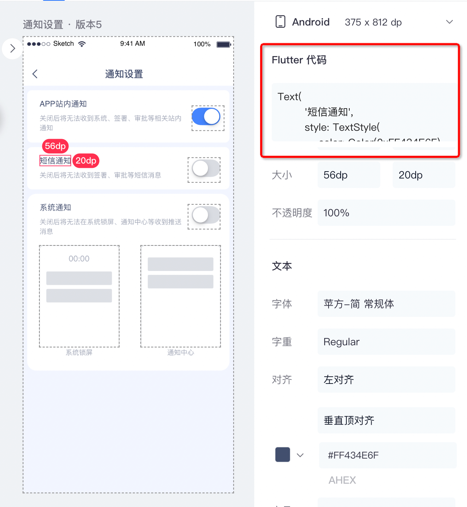

## 1. 介绍
通过`Chrome Extension`的方式，为蓝湖设计图生成Flutter代码

## 2. 安装
- 1、克隆本仓库到本地
- 2、在浏览器地址栏中直接输入chrome://extensions/，打开扩展管理页面
- 3、进入扩展管理页面后，点击打开『开发者模式』；然后点击『加载已解压的扩展程序』；
- 4、选择该仓库的本地路径下的根目录

## 3. 示例

## 4. 待优化
- 支持更多代码生成